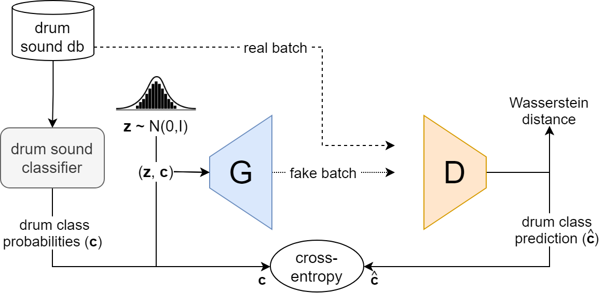

  
<h1>DrumGAN VST: A Plugin for Drum Sound Analysis/Synthesis with Autoencoding GANs</h1>

<b>Supplementary material</b>

 
This repository contains supplementary material with regard to our paper "[DrumGAN VST](paper.pdf)", submitted to the Machine Learning for Audio Synthesis (MLAS) workshop at ICML 2022.

## Overview
DrumGAN VST is a simple and intuitive plugin for drum sound synthesis employing Generative Adversarial Networks (GANs) and inspired by previous work [1]. DrumGAN VST offers the following key features:
1) 44.1 kHz sample-rate audio operability
2) Continuous instrument control over kick, snare, and cymbals: choose the amount of "kickness", "snareness", and "cymbalness" you want to confere to the synthesized sound. This control can also be used to create hymbrid sounds that morph characteristics from each instrument class, or to explore weird sounds by setting these parameters to unrealistic combinations (e.g., all to zero).
3) Analysis/resynthesis AKA encoding/decoding: DrumGAN VST features an encoding neural network that can be used to analysize/encode some pre-existing sound and decode/resynthesize variations of it. 
4) DrumGAN VST will be shortly available as an integrated feature in a commercial VST Plugin.

In what follows, we showcase the aforementioned capabilities of DrumGAN VST by providing some audio and musical examples. We also show a demo of the latest prototype (to preserve anonymity, a demo of the final commercial software will be published upon acceptance of the paper).

https://cslmusicteam.sony.fr/wp-content/uploads/2021/11/drumGAN.mp4

<!-- 

 
Diagram of DrumGAN training procedure. Rather than using the true label as conditioning information for the Generator, we use the vector of class probabilities output by a pretrained classifier. This allows continuous control on the generated class after training, which enables creating hybrid sounds.

 -->

     

<!--  
This website contains supplementary material to the following sections

  * [Increasing the sampling rate to 44,1 kHz](#increasing-the-sampling-rate-to-441-khz)
  * [From perceptual features to soft class labels](#from-perceptual-features-to-soft-class-labels)
  * [Adding an encoder](#adding-an-encoder)
 -->

## Baseline Comparisons
We compare DrumGAN VST generations with real samples and two other neural drum synthesizers as baselines: one is CRASH, based on diffusion models, and the other is Style-DrumSynth, based on StyleGAN. While the baselines are state-of-the-art, they have high bias and fail to capture the diversity of timbres in the dataset, while DrumGAN produces high quality samples similar to the real data. Samples were randomly selected to fairly reflect the diversity and quality of samples from each model. Quantitative comparisons can be found in the paper.

A flavour of its drum sound quality and diversity compared to other neurla drum synthesizers

## Instrument Control & Interpolations
We show interpolations for DrumGAN VST. Inital and target timbres are chosen from generated samples. DrumGAN VST is explicitly conditioned on a global class probability latent vector, therefore, interpolations sound like reasonable instruments across all classes.

<table>
<caption><b>Hybrid Generation </b></caption>
  <tr>
    <td></td>
    <td style="text-align: center; vertical-align: middle;"><b>Kick = 1 </b></td>
    <td style="text-align: center; vertical-align: middle;"><b>Snare = 1</b></td>
    <td style="text-align: center; vertical-align: middle;"><b>Cymbal =</b></td>
  </tr>

  <tr>
    <td style="text-align: center; vertical-align: middle;"><b>Kick = 0.2 </b></td>
    <td style="text-align: center; vertical-align: middle;">
      <audio controls>
      <source src="https://anonymous757575.github.io/drumganvst-mlas/audios/random_gen drumgan.mp3">
      </audio>
    </td>
    <td style="text-align: center; vertical-align: middle;">
      <audio controls>
      <source src="https://anonymous757575.github.io/drumganvst-mlas/audios/random_gen dsd.mp3">
      </audio>
    </td>
    <td style="text-align: center; vertical-align: middle;">
      <audio controls>
      <source src="https://anonymous757575.github.io/drumganvst-mlas/audios/random_gen crash.mp3.mp3">
      </audio>
    </td>
  </tr>

  <tr>
    <td style="text-align: center; vertical-align: middle;"><b>Kick = 0.2 </b></td>
    <td style="text-align: center; vertical-align: middle;">
      <audio controls>
      <source src="https://anonymous757575.github.io/drumganvst-mlas/audios/random_enc_dec.mp3">
      </audio>
    </td>
    <td style="text-align: center; vertical-align: middle;">
      <audio controls>
      <source src="https://anonymous757575.github.io/drumganvst-mlas/audios/soma_enc_dec.mp3">
      </audio>
    </td>
    <td style="text-align: center; vertical-align: middle;">
      <audio controls>
      <source src="https://anonymous757575.github.io/drumganvst-mlas/audios/random_gen.mp3">
      </audio>
    </td>
  </tr>
  <tr>
    <td style="text-align: center; vertical-align: middle;"><b>Kick = 0.2 </b></td>
    <td style="text-align: center; vertical-align: middle;">
      <audio controls>
      <source src="https://anonymous757575.github.io/drumganvst-mlas/audios/random_gen.mp3">
      </audio>
    </td>
    <td style="text-align: center; vertical-align: middle;">
      <audio controls>
      <source src="https://anonymous757575.github.io/drumganvst-mlas/audios/random_gen.mp3">
      </audio>
    </td>
        <td style="text-align: center; vertical-align: middle;">
      <audio controls>
      <source src="https://anonymous757575.github.io/drumganvst-mlas/audios/random_gen.mp3">
      </audio>
    </td>
  </tr>
</table>

## Analysis/Synthesis of prexisting sounds
We compare encoded and reconstructed pairs of audio examples for DrumGAN VST and Style-DrumSynth, which also incorporates an encoder analogous to ours. Encoded sounds are chosen from both the models' pre-generated samples, as well as from different real drum datasets. We can hear that DrumGAN VST's synthesized examples are generally perceived closer in terms of timbre to the original encoded sample.

<table>
<caption><b>Encoding results</b></caption>
  <tr>
    <td></td>
    <td style="text-align: center; vertical-align: middle;"><b>DrumGAN</b></td>
    <td style="text-align: center; vertical-align: middle;"><b>Style-DrumSynth</b></td>
  </tr>

  <tr>
    <td style="text-align: center; vertical-align: middle;"><b>Kick = 0.2 </b></td>
    <td style="text-align: center; vertical-align: middle;">
      <audio controls>
      <source src="https://anonymous757575.github.io/drumganvst-mlas/audios/random_gen.mp3">
      </audio>
    </td>
    <td style="text-align: center; vertical-align: middle;">
      <audio controls>
      <source src="https://anonymous757575.github.io/drumganvst-mlas/audios/random_gen.mp3">
      </audio>
    </td>
  </tr>

  <tr>
    <td style="text-align: center; vertical-align: middle;"><b>Kick = 0.2 </b></td>
    <td style="text-align: center; vertical-align: middle;">
      <audio controls>
      <source src="https://anonymous757575.github.io/drumganvst-mlas/audios/random_gen.mp3">
      </audio>
    </td>
    <td style="text-align: center; vertical-align: middle;">
      <audio controls>
      <source src="https://anonymous757575.github.io/drumganvst-mlas/audios/random_gen.mp3">
      </audio>
    </td>
  </tr>

</table>

## References

[1] Nistal, J., Lattner, S., and Richard, G. DrumGAN: Synthesis of Drum Sounds With Timbral Feature Conditioning Using Generative Adversarial Networks. In Proc. of the 21st International Society for Music Information Retrieval, ISMIR, Montréal, Canada, 2020.
